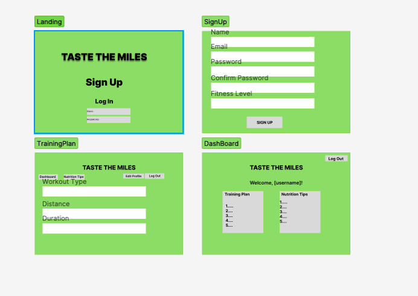
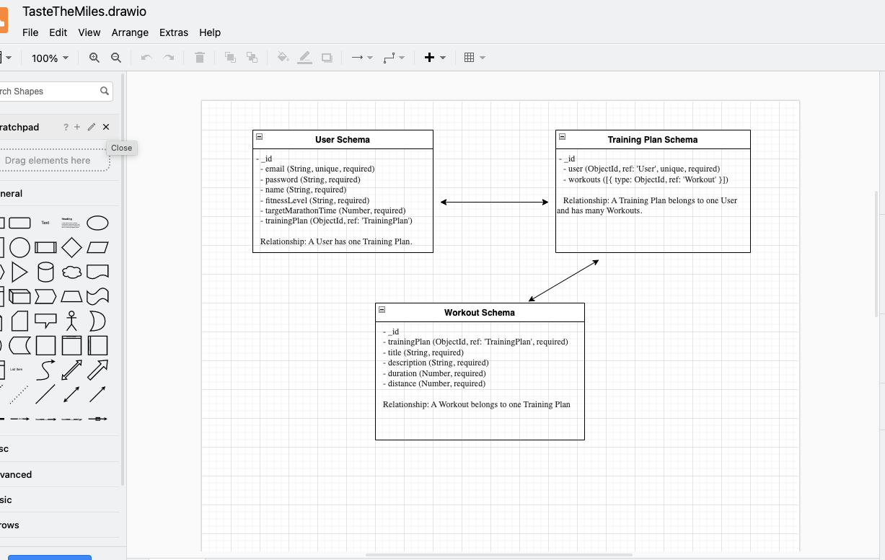

# Taste the Miles

Taste the Miles is a marathon prep app. 

## Table of Contents
- [Features](#features)
- [Technologies Used](#technologies-used)
- [Installation and Setup](#installation-and-setup)
- [Future Enhancements](#future-enhancements)

## Features

- User Authentication (Sign-up, Log in & Log out)
- Creates Workouts for Training Plan 

## Technologies Used

## Project Links

- [Trello Board](https://trello.com/b/qJMbybIZ/tastethemiles)
- [GitHub Repository](https://github.com/marinayasinsky/TasteTheMiles)

## Future Enhancements
- Nutrition Tips Page (General nutrition advice and guidelines for marathon training)
- Expand training modules for different race distances
- Enhance nutrition guidance with more in-depth meal planning, recipes, and grocery lists
- Integrate with additional wearable devices and fitness apps
- Add a training resources library
- Implement gamification and achievements

